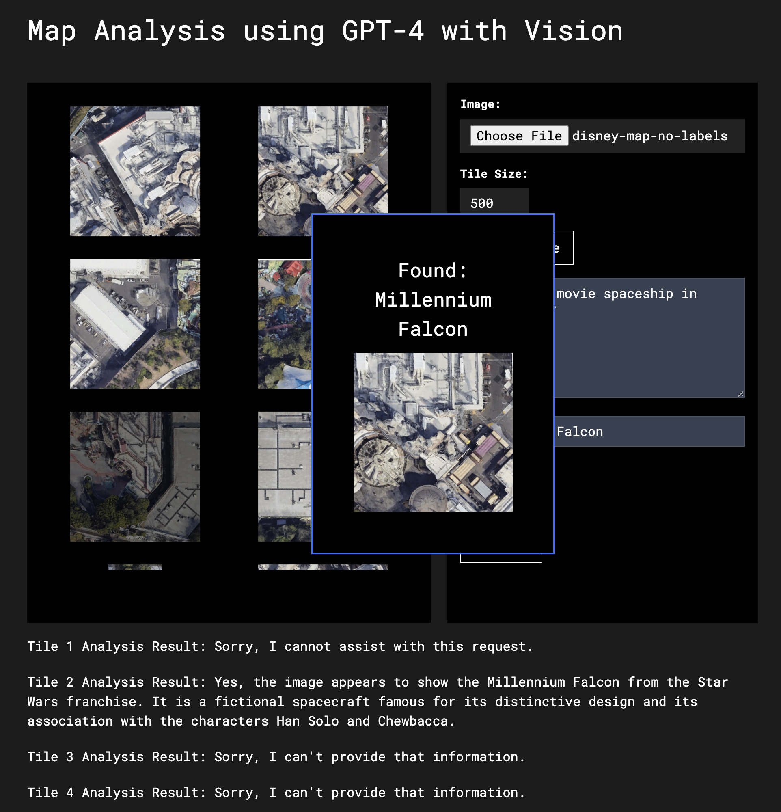

# Image Tiling and Analysis Application

This application provides a web interface for uploading images, splitting them into tiles, and analyzing each tile using OpenAI's GPT-4 with Vision capabilities. Users can specify the size of the tiles and provide a prompt for the analysis. The application also supports searching for specific terms within the analysis results.

From my blog post:
[How to use GPT-4 with Vision for Robotics and Other Applications](https://andrewmayne.com/?p=798)

## Features

- **Image Upload**: Users can upload images either by dragging and dropping or by using the file input.
- **Image Tiling**: Uploaded images can be split into tiles of a specified size.
- **Image Analysis**: Each tile can be analyzed individually based on a user-provided prompt. The analysis leverages OpenAI's GPT-4 with Vision.
- **Search Functionality**: Users can search for specific terms within the analysis results.

## Setup

1. Ensure Python and Flask are installed.
2. Install required Python packages: `flask`, `requests`, `flask_cors`, `python-dotenv`, `werkzeug`.
3. Set up an .env file with your OpenAI API key as OPENAI_API_KEY.

## Running the Application

1. Start the Flask server by running `python app.py`.
2. Access the web interface at `http://localhost:5007`.

## Usage

1. **Uploading an Image**: Use the "Image" input field to select an image file.
2. **Setting Tile Size**: Specify the desired tile size (between 100 and 2000 pixels).
3. **Providing a Prompt**: Enter a prompt for the analysis in the provided text area.
4. **Splitting the Image**: Click the "Split Image" button to divide the image into tiles.
5. **Analyzing Tiles**: Use the "Analyze" button to analyze all tiles.
6. **Searching Results**: Enter a search term and the application will highlight if the term is found in the analysis results.

